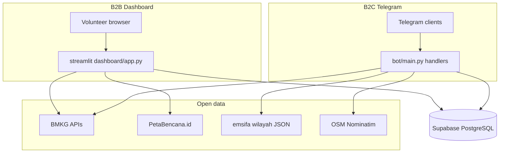

# RFC — Telegram + Streamlit Disaster Response MVP

Engineering answer to [PRD.md](PRD.md): how we build the product, what we chose, and what we traded off.

## SDLC phase coverage

Every standard phase has a named artifact and a **done when** gate. Judges and AI should trace work across this table.

| Phase | Activities | Primary artifacts | Done when |
|-------|------------|-------------------|-----------|
| **1. Planning** | Problem, scope, feasibility, constraints | [PRD.md](PRD.md) (Problem, Constraints, Non-goals), [README.md](README.md) | One-sentence problem; MVP vs post-MVP scope explicit |
| **2. Requirements** | User stories, acceptance criteria, edge cases | [PRD.md](PRD.md) (stories, scenario IDs) | Each story has criteria + Given/When/Then table |
| **3. Design** | Architecture, stack, schema, API contracts, trade-offs | This RFC, [database/schema.sql](database/schema.sql) | Diagram + locked versions; schema applied in Supabase |
| **4. Implementation** | Bot, dashboard, services; phased build | `bot/`, `dashboard/`, `utils/`, [AGENTS.md](AGENTS.md) phases 1–4 | AGENTS phase smoke commands pass |
| **5. Testing** | TDD, unit/integration, acceptance traceability | PRD scenarios, § Verification & TDD below, `tests/` | Scenario IDs covered; `pytest` green or live demo matches PRD |
| **6. Deployment** | Env, secrets, webhook, cloud hosts | `.env.example`, `bot/main_production.py`, `deploy/`, § DevOps below | Hosted URLs work; no secrets in git; webhook or polling demo ready |
| **7. Operations** | Degradation, rate limits, logging, incident UX | `utils/retry.py`, service `try/except`, PRD Story 6 (G-*) | Partial API outage → user message, not crash |
| **8. Maintenance** | Roadmap, tech debt, evolution | PRD post-hackathon roadmap, § Trade-offs below | Deferred work (WhatsApp, LLM) documented, not half-built |

**Cross-cutting — Documentation:** README.md, AGENTS.md (setup commands and boundaries for developers and AI).

### Phase gates (PowerShell)

| Phase | Verify |
|-------|--------|
| 1–2 | PRD readable; every checkbox maps to a scenario ID |
| 3 | `database/schema.sql` run in Supabase SQL Editor |
| 4 | `python -c "from bot.main import build_app; build_app(); print('bot app OK')"` |
| 5 | `pytest tests/ -v` (when present) + manual demo per PRD |
| 6 | Bot webhook via `main_production` or VPS `deploy/`; dashboard on Streamlit (local systemd or Cloud) |
| 7 | Kill BMKG network → bot still answers with fallback (G-01, G-02) |
| 8 | Non-goals in PRD match RFC trade-off decisions |

### Deployment checklist (phase 6)

1. Supabase project created; `database/schema.sql` applied.
2. `.env` from `.env.example` — never committed.
3. **Dev:** `python -m bot.main` (polling; no `WEBHOOK_URL` required).
4. **Prod bot:** `python -m bot.main_production` (FastAPI webhook) or `./deploy/run_production.sh` on VPS; set `WEBHOOK_URL`, `PORT`, `STREAMLIT_PORT` in `.env`.
5. **Dashboard:** `streamlit run dashboard/app.py` locally; on VPS via `deploy/disaster-dashboard.service` or Streamlit Community Cloud.
6. Submission bundle for judges: GitHub URL, deployed bot/dashboard URLs, PRD.md, RFC.md, screenshots (`llms.txt` not required).

## Solution design

### Architecture overview

Two clients share one database and the same open-data sources:

- **B2C — Telegram Bot** (`bot/`): async handlers, inline keyboard navigation, `ConversationHandler` for mutual-aid reports, `httpx` for external APIs, Supabase client for persistence.
- **B2B — Streamlit dashboard** (`dashboard/`): Folium map with multiple layers, sidebar filters, cached data loaders (`ttl=60`).
- **Data layer — Supabase (PostgreSQL)**: `users`, `mutual_aid_reports`, optional `api_cache_logs`; RLS limits writes to matching `telegram_id`.



### Bot flows

| Flow | Entry | Implementation |
|------|-------|----------------|
| Main menu | `/start` | `bot/handlers/start.py` — `InlineKeyboardMarkup`: weather, quake, report |
| Weather | `cmd_weather` | `bot/handlers/weather.py` — GPS (Nominatim) or text search → wilayah drill-down / kecamatan shortcut → BMKG `adm4` |
| Earthquake | `cmd_quake` | `bot/handlers/quake.py` — `autogempa.json` / recent list |
| Report | `cmd_report` | `bot/handlers/report.py` — states: type → description → location → Supabase insert; auto-captures Telegram contact for NEED_HELP/OFFER_HELP |

Callbacks use `query.edit_message_text` and `await query.answer()` first to avoid stuck loading spinners.

### Dashboard

| Piece | Location |
|-------|----------|
| App entry | `dashboard/app.py` |
| Map layers | `dashboard/components/map_view.py` |
| Status filters | `dashboard/components/filters.py` |
| Cached fetch | `dashboard/services/data_loader.py` — `@st.cache_data(ttl=60)` |

Map layers (per PRD):

- Red — earthquake epicenter (BMKG `autogempa.json`, M≥5.0 emphasis)
- Blue — PetaBencana flood/wind GeoJSON (`timeperiod=3h`)
- Green markers — `mutual_aid_reports` (need vs offer differentiated)

### External APIs

| Source | Endpoint | Notes |
|--------|----------|-------|
| BMKG weather | `GET …/prakiraan-cuaca?adm4={code}` | 60 req/min/IP; fields: `t`, `hu`, `ws`, `weather_desc` |
| BMKG quake | `autogempa.json`, `gempaterkini.json` | Small JSON payloads |
| Wilayah | `emsifa.github.io/api-wilayah-indonesia/api/*` | Static hierarchy; provinces/regencies at startup; districts lazy-loaded on first weather search |
| Nominatim | `GET nominatim.openstreetmap.org/reverse` | GPS → address; 1 req/sec; `User-Agent` required; Indonesia-only |
| PetaBencana | `GET /reports?geoformat=geojson&timeperiod=3h` | Custom `User-Agent` header required |

All external calls: `try/except` + user-facing fallback; optional retry via `utils/retry.py` on HTTP 429.

### Database schema

Defined in `database/schema.sql`:

| Table | Purpose |
|-------|---------|
| `users` | `telegram_id`, optional `kode_adm4`, `is_subscribed` (reserved — no push cron in MVP) |
| `mutual_aid_reports` | `report_type` enum, `description`, lat/lon, `contact_name`, `telegram_username`, `status` enum |
| `api_cache_logs` | JSONB cache table — **schema only**; MVP uses Streamlit `@st.cache_data` instead |

Enums: `report_type` (`NEED_HELP`, `OFFER_HELP`, `INFO_ONLY`); `report_status` (`OPEN`, `IN_PROGRESS`, `RESOLVED`).

### Runtime modes

| Mode | When | Mechanism |
|------|------|-----------|
| Long polling | Hackathon dev, local demo | `python -m bot.main` → `app.run_polling()` |
| Webhook (production) | VPS + Cloudflare tunnel or public HTTPS | `python -m bot.main_production` — FastAPI `/webhook`, uvicorn on `PORT` |
| VPS bundle | Ubuntu production | [`deploy/run_production.sh`](deploy/run_production.sh), systemd units in [`deploy/`](deploy/) |

Alternative (not primary for this repo): Render.com webhook via `bot/main.py` TODO block.

Only one polling instance per bot token may run at a time; multiple `getUpdates` clients cause Telegram `Conflict` errors.

## Stack

### Backend / bot

| Item | Version (locked in repo) | Role |
|------|--------------------------|------|
| Python | 3.10+ | Runtime |
| python-telegram-bot | ≥20.7 | Async Telegram bot framework |
| httpx | ≥0.27.0 | Async HTTP client for BMKG / PetaBencana / wilayah |
| supabase | ≥2.3.0 | PostgreSQL client (REST) |
| python-dotenv | ≥1.0.0 | Env loading |
| fastapi | ≥0.110.0 | Optional webhook server wrapper |
| uvicorn | ≥0.27.0 | ASGI server for webhook host |

### Frontend / dashboard

| Item | Version | Role |
|------|---------|------|
| streamlit | ≥1.32.0 | Dashboard UI (no separate React app) |
| streamlit-folium | ≥0.20.0 | Embed Folium maps |
| folium | ≥0.15.0 | GeoJSON / marker layers |
| pandas | ≥2.2.0 | Tabular report data |

### Design

No custom design system. Streamlit default components + Folium map styling. Telegram uses native inline keyboards — no custom chat UI assets.

### DevOps / hosting

| Component | Target platform | Notes |
|-----------|-----------------|-------|
| Bot (webhook) | VPS + Cloudflare (`deploy/`) | `main_production.py`, `WEBHOOK_URL` without trailing slash |
| Bot (dev) | Local | `python -m bot.main` polling |
| Dashboard | VPS systemd or Streamlit Community Cloud | `STREAMLIT_PORT` default 8501 |
| Database | Supabase | Apply `database/schema.sql` in SQL Editor |

Environment variables (see `.env.example`):

- Required: `TELEGRAM_BOT_TOKEN`, `SUPABASE_URL`, `SUPABASE_KEY`
- Production: `WEBHOOK_URL`, `PORT`, `STREAMLIT_PORT`
- Optional overrides: BMKG / PetaBencana / wilayah base URLs, `PETABENCANA_USER_AGENT`

## Constraints

| Type | Constraint |
|------|------------|
| **Time** | 4–5 hour hackathon; phased build (setup → data → bot → dashboard → deploy) |
| **People** | One codebase, minimal abstraction; handlers orchestrate, services fetch |
| **Cost** | $0 target — all listed services have free tiers |
| **Platforms** | Telegram (mobile), modern browser (dashboard), Linux container on Render |
| **Rate limits** | BMKG 60/min/IP; Telegram ~1 msg/s per chat; dashboard caching mandatory |
| **Security** | No `.env` in git; RLS on Supabase; anon key only in client apps |

## Trade-offs

### Telegram Bot vs WhatsApp Cloud API

| | Telegram | WhatsApp |
|---|----------|----------|
| Pros | Instant bot setup, rich inline UI, no template approval, async library mature | Higher penetration in Indonesia grassroots users |
| Cons | Smaller default audience than WhatsApp | Template approval, tier limits (250→2000 users), heavier compliance |
| **Decision** | **Telegram for MVP** | Documented as post-hackathon migration in PRD non-goals |

### Streamlit vs React / v0 / bolt.new

| | Streamlit | React SPA |
|---|-----------|-----------|
| Pros | Map + filters in one Python file; no API bridge; fast for data apps | Polished UI, component ecosystem |
| Cons | Limited visual branding; full script rerun on interaction | 4–5 h insufficient for bot + APIs + separate frontend |
| **Decision** | **Streamlit** | Rejected for hackathon time box |

### Supabase vs custom FastAPI + PostgreSQL

| | Supabase | Custom backend |
|---|----------|----------------|
| Pros | Instant REST, RLS, no migration tooling needed for MVP | Full control, custom auth |
| Cons | Vendor coupling; RLS learning curve | CRUD + deploy time eats hackathon budget |
| **Decision** | **Supabase** | Rejected — unnecessary for MVP scope |

### Long polling vs webhook

| | Long polling | Webhook |
|---|--------------|---------|
| Pros | No public URL/SSL; works on laptop + tethering | Efficient on free hosts; no standing `getUpdates` connection |
| Cons | Only one dev instance; bad for production idle limits | Requires public HTTPS URL and correct Render config |
| **Decision** | **Polling for dev** | **Webhook for production demo** |

### In-memory cache vs Redis

| | `@st.cache_data` + optional DB cache table | Redis |
|---|---------------------------------------------|-------|
| Pros | Zero extra infra | Shared cache across instances |
| Cons | Per-process cache on Streamlit | Another service to provision |
| **Decision** | **Streamlit cache + optional `api_cache_logs`** | Rejected for MVP |

### Fuzzy wilayah matching vs drill-down picker

| | Drill-down buttons | GPS + kecamatan text search |
|---|---------------------|------------------------------|
| Pros | Deterministic `adm4`; no bad BMKG queries | Faster UX — 1 tap (GPS) or 1 text input (kecamatan) |
| Cons | More taps for province/kab path | Nominatim rate limit (1 req/sec); name normalization needed |
| **Decision** | **Kept for province/kab** | **GPS via Nominatim + kecamatan-level `smart_search`** |

Weather flow (updated):

1. User taps **Info Cuaca** → choose **GPS** or **type wilayah**
2. **GPS path:** Telegram location → Nominatim reverse geocode → fuzzy match to Emsifa district → first village `adm4` → BMKG
3. **Text path:** `smart_search` on province / regency / district (districts lazy-cached) → drill-down buttons OR direct weather if kecamatan matched
4. **Fallback:** Nominatim or match failure → prompt user to type location manually

## Repository layout

```
disaster-response-mvp/
├── PRD.md / RFC.md              # Product + engineering docs (what judges score)
├── bot/
│   ├── main.py                  # dev polling entrypoint
│   ├── main_production.py       # prod FastAPI webhook
│   ├── config.py                # env + validate_config()
│   ├── handlers/                # start, weather, quake, report
│   └── services/                # bmkg, petabencana, wilayah, nominatim, supabase_client
├── dashboard/
│   ├── app.py
│   ├── components/              # map_view, filters
│   └── services/
│       ├── data_loader.py
│       └── report_filter.py     # filter_reports() — pure, testable
├── deploy/                      # VPS: systemd units, setup_ubuntu.sh, run_production.sh
├── database/schema.sql
├── tests/                       # pytest — see PRD scenario IDs
└── utils/retry.py               # exponential backoff + jitter
```

### Weather adm4 conversion (W-08)

`bot/services/bmkg.py` — `format_adm4_for_bmkg(village_id)`:

- Input: emsifa village ID (e.g. `3674060001`)
- Output: BMKG Kemendagri adm4 (e.g. `36.74.06.1001`)
- Rule: village suffix offset +1000 (BMKG uses 1001-based desa codes)

`bot/services/wilayah.py` — `resolve_adm4_for_bmkg(district_id)`:

- Fetches villages for district, picks first, converts via `bmkg.format_adm4_for_bmkg()`
- Returns `None` if no villages found

## Verification & TDD (for implementers and AI)

### Iron rule

No new behavior without a failing test scenario from [PRD.md](PRD.md) first.

**Exceptions (hackathon):** docs-only changes, `.env`, deployment config — no automated test required.

**Characterization tests** on existing code may pass on first run. **New features and bug fixes** must show RED before GREEN.

### Test layers

| Layer | What to test | How |
|-------|--------------|-----|
| Pure functions | `format_weather_summary`, `format_quake_summary`, `find_best_match`, `format_adm4_for_bmkg`, `filter_reports`, `build_map` marker colors | `pytest`; no mocks |
| HTTP services | `bmkg`, `petabencana`, `wilayah` fetchers | `httpx` mock transport or `pytest-httpx`; never hit real BMKG in CI |
| Handlers | `report`, `quake`, `start`, `weather` | `pytest-asyncio` + minimal Telegram `Update` fixtures; mock `supabase_client` at DB boundary only |
| Dashboard loaders | `data_loader.py` | Mock `httpx.Client` and `supabase_client`; do not run Streamlit in unit tests |

### Red-green order (matches AGENTS.md phases)

1. `validate_config` — C-01
2. `utils/retry` + `wilayah.find_best_match` — RT-01, RT-02, L-01–L-04
3. BMKG formatters + fetch with mocks — W-05–W-07, Q-02–Q-04
4. `format_adm4_for_bmkg` — W-08
5. Weather handlers + Nominatim mocks — W-01, W-09–W-11
6. Report handler flow (mock Supabase) — R-01–R-09
7. `filter_reports` + `build_map` — F-01, M-02–M-06
8. `build_app()` smoke — C-02

### PRD scenario → test file mapping

| Test file | Scenario IDs |
|-----------|--------------|
| `tests/test_config.py` | C-01 |
| `tests/test_retry.py` | RT-01, RT-02 |
| `tests/test_wilayah.py` | L-01–L-06 |
| `tests/test_bmkg.py` | W-05–W-07, Q-02–Q-04 |
| `tests/test_weather_adm4.py` | W-08 |
| `tests/test_handlers_report.py` | R-01–R-09 |
| `tests/test_handlers_quake.py` | Q-01, Q-03 |
| `tests/test_handlers_weather.py` | W-01, W-10, W-11 |
| `tests/test_nominatim.py` | W-09 (reverse geocode boundaries) |
| `tests/test_start.py` | C-02 (build_app) |
| `tests/test_map_view.py` | M-02–M-06, F-04 |
| `tests/test_report_filter.py` | F-01 |

### Dev dependencies

Listed in `requirements.txt`:

```powershell
pip install -r requirements.txt
pytest tests/ -v
```

### Judge guardrails (verification checklist)

| Guardrail | Command / action | Status |
|-----------|------------------|--------|
| **Match the plan** | Every PRD scenario ID (W-/Q-/R-/M-/F-/G-/C-/RT-/L-) has a test in `tests/` | 45 tests |
| **TDD** | Unit + integration tests prove stories; handlers mocked at DB/API boundary | `pytest tests/ -v` |
| **Lint** | No new linter errors in `tests/` and changed modules | run IDE linter before submit |
| **Run the app** | Smoke checks with real `.env` | see below |
| **Agent verify** | Re-run pytest + smoke after any AI edit | automated |

```powershell
# Phase smoke checks (no pytest required)
python -c "from bot import config; config.validate_config(); print('config OK')"
python -c "from bot.main import build_app; build_app(); print('bot app OK')"
python -c "from dashboard.services.data_loader import load_recent_quakes; print('dashboard import OK')"

# Full test suite
pytest tests/ -v
```

Live demo: Telegram bot menu + one report saved + dashboard map shows layers and status filter.
